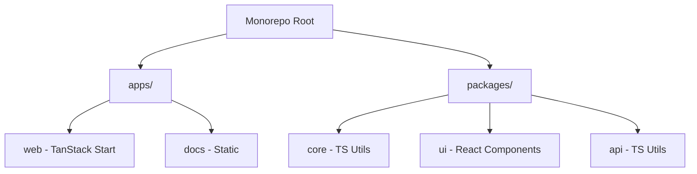

# PRD: Monorepo Migration to Bun

| Metadata    | Value                      |
| :---------- | :------------------------- |
| **Title**   | pnpm to Bun Migration Plan |
| **Version** | 1.2.0                      |
| **Date**    | 2025-12-29                 |
| **Status**  | Draft                      |
| **Author**  | Technical Writer Agent     |

---

## 1. Overview

### Executive Summary

This document outlines the strategy and technical requirements for migrating our existing TypeScript monorepo from **pnpm/Node.js** to **Bun**. The goal is to leverage Bun's superior performance in package management, test execution, and runtime execution while maintaining our existing monorepo architecture and TanStack Start integration.

### Goals

- Replace `pnpm` with `bun` as the primary package manager.
- Utilize Bun runtime for development and production where stable.
- Maintain existing Turborepo build orchestration.
- Preserve "live types" pattern via custom export conditions.
- Improve developer experience with faster installation and reliable Hot Module Replacement (HMR).

### Non-Goals

- Migrating away from Turborepo.
- Changing the existing application architecture or UI frameworks.
- Immediate full removal of Node.js from all CI environments (some tools may still require it).

### Success Metrics

- **Installation Speed**: 50% reduction in `install` time in CI.
- **Build Time**: 20% reduction in total monorepo build time.
- **Developer Productivity**: Sub-second cold starts for the development server.

---

## 2. Background

### Current Architecture Overview

The project is a TypeScript monorepo managed by pnpm workspaces and Turborepo.

- **apps/web**: Full-stack application using TanStack Start (React 19) and Vite 7.
- **apps/docs**: Static content.
- **packages/core**: Shared logic and utilities.
- **packages/ui**: Shared React components (shadcn/ui style).

### Why Migrate to Bun?

1. **Speed**: Bun is significantly faster than pnpm and npm for dependency installation.
2. **Runtime Integration**: Native TypeScript execution without an explicit transpilation step for many tools.
3. **Unified Tooling**: Bun combines a package manager, bundler, and test runner into a single executable.
4. **Nitro Support**: TanStack Start uses Nitro, which has first-class support for Bun.

### Performance Comparison

| Operation            | pnpm               | Bun        | Improvement |
| -------------------- | ------------------ | ---------- | ----------- |
| Install (cold)       | ~45s               | ~8s        | 5.6× faster |
| Install (cached)     | ~15s               | ~3s        | 5× faster   |
| TypeScript execution | Requires transpile | Native     | Instant     |
| HTTP throughput      | ~13k req/s         | ~52k req/s | 4× faster   |

### Risk Assessment

- **Ecosystem Compatibility**: Some niche dependencies might rely on Node-specific APIs not yet fully implemented in Bun.
- **Lockfile Migration**: Transitioning from `pnpm-lock.yaml` to `bun.lock` needs careful verification.

---

## 3. Current State

### Package Structure



### Current Workflow

- **Install**: `pnpm install`
- **Dev**: `pnpm dev` (executes `turbo run dev`)
- **Build**: `pnpm build` (executes `turbo run build`)
- **Type Check**: `pnpm check-types`

---

## 5. Target State

### Root Configuration (`package.json`)

The `packageManager` field will be updated to target Bun, and workspaces will use the `catalog` feature for dependency management.

```json
{
  "name": "home",
  "private": true,
  "type": "module",
  "packageManager": "bun@1.3.5",
  "workspaces": {
    "packages": ["apps/*", "packages/*"],
    "catalog": {
      "react": "^19.2.3",
      "react-dom": "^19.2.3",
      "@types/react": "^19.2.7",
      "@types/react-dom": "^19.2.3"
    },
    "catalogs": {
      "typescript": {
        "typescript": "^5.9.3"
      }
    }
  },
  "scripts": {
    "dev": "turbo run dev",
    "build": "turbo run build",
    "check-types": "turbo run check-types",
    "fix": "ultracite fix",
    "check": "ultracite check"
  },
  "devDependencies": {
    "@types/bun": "latest",
    "oxfmt": "^0.21.0",
    "oxlint": "^1.36.0",
    "turbo": "^2.7.2",
    "typescript": "catalog:typescript",
    "ultracite": "7.0.6"
  }
}
```

### TanStack Start Configuration (`apps/web/vite.config.ts`)

The full `vite.config.ts` configuration utilizing the Nitro Bun preset.

> **Reference**: [TanStack Start Bun Hosting](https://tanstack.com/start/latest/docs/framework/react/guide/hosting#bun)

```typescript
import tailwindcss from "@tailwindcss/vite";
import { tanstackStart } from "@tanstack/react-start/plugin/vite";
import { nitro } from "nitro/vite";
import viteReact from "@vitejs/plugin-react";
import { defineConfig } from "vite";
import mkcert from "vite-plugin-mkcert";
import tsConfigPaths from "vite-tsconfig-paths";

export default defineConfig({
  server: {
    port: 3000,
  },
  resolve: {
    conditions: ["@packages/source"],
  },
  plugins: [
    tailwindcss(),
    tsConfigPaths({
      projects: ["./tsconfig.json"],
    }),
    tanstackStart({
      srcDirectory: "src",
    }),
    nitro({ preset: "bun" }),
    viteReact(),
    mkcert(),
  ],
});
```

**Key change**: Add `nitro({ preset: "bun" })` to the plugins array. This tells Nitro to build for the Bun runtime.

### Application Configuration (`apps/web/package.json`)

**Key changes**:

- Add `nitro` as a dependency (required for the Bun preset)
- Update scripts to use `bun --bun` flag (ensures Bun runtime is used, not Node.js)

```json
{
  "name": "web",
  "private": true,
  "sideEffects": false,
  "type": "module",
  "scripts": {
    "dev": "bun --bun vite dev",
    "build": "bun --bun vite build && tsc --noEmit",
    "preview": "bun --bun vite preview",
    "start": "bun run .output/server/index.mjs"
  },
  "dependencies": {
    "@packages/core": "workspace:*",
    "@packages/ui": "workspace:*",
    "@tanstack/react-router": "^1.145.0",
    "@tanstack/react-router-devtools": "^1.145.0",
    "@tanstack/react-start": "^1.145.0",
    "nitro": "^3.0.0",
    "react": "catalog:react",
    "react-dom": "catalog:react",
    "tailwind-merge": "^2.6.0",
    "zod": "^3.24.2"
  },
  "devDependencies": {
    "@tailwindcss/vite": "^4.1.18",
    "@types/node": "^22.5.4",
    "@types/react": "catalog:react",
    "@types/react-dom": "catalog:react",
    "@vitejs/plugin-react": "^4.6.0",
    "typescript": "catalog:typescript",
    "vite": "^7.1.7",
    "vite-tsconfig-paths": "^5.1.4"
  }
}
```

### Version Requirements

| Tool           | Minimum Version | Recommended | Notes                                                 |
| -------------- | --------------- | ----------- | ----------------------------------------------------- | ----- |
| Bun            | 1.2.0           | 1.3.5+      | Latest stable, use `curl -fsSL https://bun.sh/install | bash` |
| Turborepo      | 2.6.0           | 2.7.2       | Bun stable since 2.6                                  |
| TanStack Start | 1.142.3         | 1.145.0     | Latest with full Bun support                          |
| React          | 19.0.0          | 19.2.3      | Required for Bun runtime                              |
| Vite           | 7.0.0           | 7.1.7+      | Compatible with Bun                                   |
| TypeScript     | 5.0.0           | 5.9.3       | No changes needed                                     |

### GitHub Actions Workflow (`.github/workflows/ci.yml`)

```yaml
name: CI

on:
  push:
    branches: [main]
  pull_request:
    branches: [main]

jobs:
  build:
    runs-on: ubuntu-latest
    steps:
      - uses: actions/checkout@v4

      - name: Setup Bun
        uses: oven-sh/setup-bun@v2
        with:
          bun-version: latest

      - name: Install dependencies
        run: bun install --frozen-lockfile

      - name: Type check
        run: bun run check-types

      - name: Lint
        run: bun run check

      - name: Build
        run: bun run build
```

---

## 6. Detailed Migration Plan

### What Bun Does Automatically

When running `bun install` in a project with `pnpm-lock.yaml` (and no `bun.lock`), Bun **automatically migrates**:

| Migration Step                                                   | Automatic | Manual |
| ---------------------------------------------------------------- | :-------: | :----: |
| Lockfile conversion (`pnpm-lock.yaml` → `bun.lock`)              |    ✅     |        |
| Workspace configuration (`pnpm-workspace.yaml` → `package.json`) |    ✅     |        |
| Catalog migration (preserves `catalog:` protocol)                |    ✅     |        |
| `packageManager` field update                                    |           |   ✅   |
| Add `@types/bun`                                                 |           |   ✅   |
| Update turbo version                                             |           |   ✅   |
| Nitro bun preset in `vite.config.ts`                             |           |   ✅   |
| Update `apps/web` scripts                                        |           |   ✅   |
| CI/CD workflow updates                                           |           |   ✅   |

> **Reference**: [Bun pnpm Migration Docs](https://bun.com/docs/pm/cli/install#pnpm-migration)

### Phase 1: Preparation

- [ ] Install latest Bun: `curl -fsSL https://bun.sh/install | bash`
- [ ] Verify Bun version: `bun --version` (should be 1.3.5+)
- [ ] Create a new feature branch: `git checkout -b feat/bun-migration`
- [ ] Notify the team about the package manager change to avoid lockfile conflicts.

### Phase 2: Automatic Migration

1. **Run Bun install** (automatic migration happens):

   ```bash
   bun install
   ```

   This automatically:
   - Converts `pnpm-lock.yaml` → `bun.lock`
   - Migrates `pnpm-workspace.yaml` workspaces and catalogs → `package.json`
   - Preserves all `catalog:` protocol dependencies

2. **Verify migration**:

   ```bash
   # Check lockfile was created
   ls bun.lock

   # Check workspaces were migrated
   cat package.json | grep -A 10 '"workspaces"'

   # Check workspace symlinks
   ls -la node_modules/@packages
   ```

### Phase 3: Manual Updates

1. **Update root `package.json`**:

   ```bash
   # Update packageManager field
   # Change: "packageManager": "pnpm@9.15.1"
   # To:     "packageManager": "bun@1.3.5"

   # Add Bun types and update turbo
   bun add -D @types/bun turbo@^2.7.2
   ```

2. **Add nitro to apps/web**:

   ```bash
   bun add nitro --cwd apps/web
   ```

3. **Update `apps/web/vite.config.ts`** with Nitro Bun preset (see Target State section).

4. **Update `apps/web/package.json` scripts**:
   - `"dev": "bun --bun vite dev"`
   - `"build": "bun --bun vite build && tsc --noEmit"`
   - `"start": "bun run .output/server/index.mjs"`

### Phase 4: Verification

- [ ] `bun install` completes without errors.
- [ ] `bun run dev` starts the web app and HMR works.
- [ ] `bun run build` generates `.output` directory.
- [ ] `bun run start` serves production build.
- [ ] Verify `@packages/core` and `@packages/ui` resolve correctly using the `@packages/source` condition.
- [ ] Run `bun run check-types` across the monorepo.

### Phase 5: Cleanup (after verification passes)

```bash
# Remove old pnpm files
rm pnpm-lock.yaml pnpm-workspace.yaml
```

### Phase 6: CI/CD Updates

Update GitHub Actions workflows as specified in the Target State section.

### Phase 7: Documentation

- [ ] Update `README.md` with new `bun` commands.
- [ ] Update `CLAUDE.md` (if exists) to reflect the shift to Bun.
- [ ] Update `apps/docs/content/typescript.md` with Bun-specific TS execution details.

---

## 7. Known Issues & Workarounds

| Issue                  | GitHub | Status | Impact | Workaround                                              |
| ---------------------- | ------ | ------ | ------ | ------------------------------------------------------- |
| Workspace Installation | N/A    | N/A    | Usage  | Use root `bun install` or `--cwd` for specific packages |

---

## 8. Testing & Validation Checklist

- [ ] `bun install` completes without errors.
- [ ] `bun.lock` was created (automatic lockfile migration).
- [ ] `package.json` contains `workspaces` config (automatic workspace migration).
- [ ] Workspace symlinks exist: `ls -la node_modules/@packages`
- [ ] `bun run dev` starts the web app and HMR works.
- [ ] `bun run build` generates `.output` directory.
- [ ] Production server starts with `bun run start`.
- [ ] `bun run check-types` passes across all packages.
- [ ] "Live types" resolution works (modifying a package reflects immediately in `apps/web` without a rebuild).

---

## 9. Rollback Procedure

In case of critical failure:

```bash
# 1. Checkout the previous working state
git checkout main -- package.json pnpm-workspace.yaml

# 2. Remove Bun artifacts
rm -rf node_modules bun.lock bun.lockb

# 3. Restore pnpm lockfile
git checkout main -- pnpm-lock.yaml

# 4. Reinstall with pnpm
pnpm install

# 5. Verify
pnpm run dev
pnpm run build
```

---

## 10. Decision Log

| Decision            | Options Considered        | Chosen    | Rationale                            |
| ------------------- | ------------------------- | --------- | ------------------------------------ |
| Package Manager     | npm, yarn, pnpm, bun      | Bun       | 5× faster installs, native TS        |
| Dev Runtime         | Node, Bun                 | Bun       | Full Bun supported per official docs |
| Build Orchestration | Turborepo, Nx, native Bun | Turborepo | Already in use, stable with Bun      |
| Production Runtime  | Node, Bun                 | Bun       | 4× HTTP throughput                   |

---

## 11. Appendix

### Useful Commands

- `bun x <package>`: Run a package executable (replaces `pnpm dlx`).
- `bun run <script>`: Run a workspace script.
- `bun add <package> --workspace`: Add a dependency to a specific workspace.

### External Links

- [Bun Documentation](https://bun.com/docs)
- [Bun pnpm Migration](https://bun.com/docs/pm/cli/install#pnpm-migration) - Automatic lockfile and workspace migration
- [Bun Workspaces Guide](https://bun.com/docs/pm/workspaces)
- [Bun Catalogs](https://bun.com/docs/pm/catalogs) - Dependency version management
- [TanStack Start + Bun](https://bun.com/docs/guides/ecosystem/tanstack-start)
- [TanStack Start Hosting (Bun)](https://tanstack.com/start/latest/docs/framework/react/guide/hosting#bun)
- [Turborepo + Bun](https://turborepo.com/blog/turbo-2-6#bun-package-manager-to-stable)
